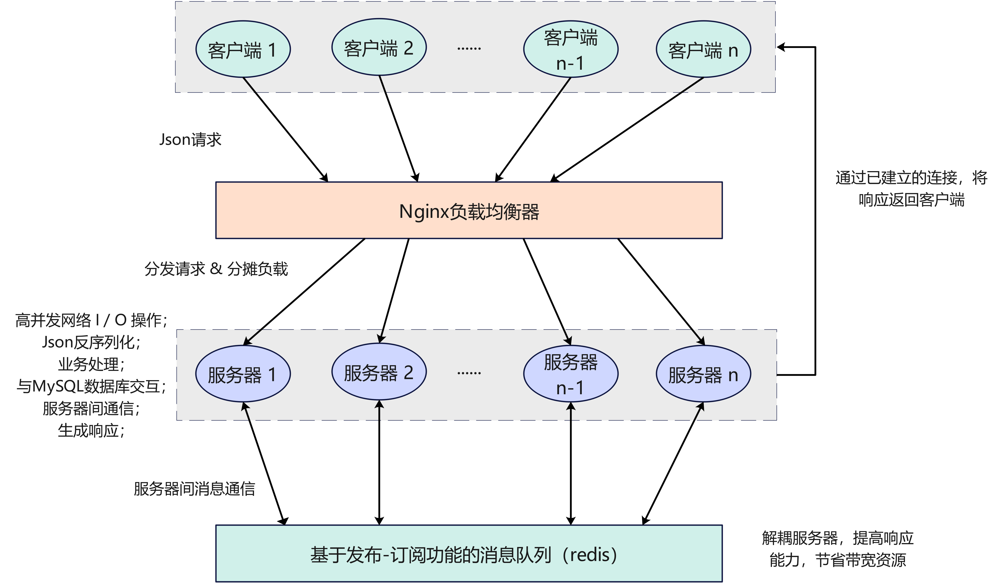
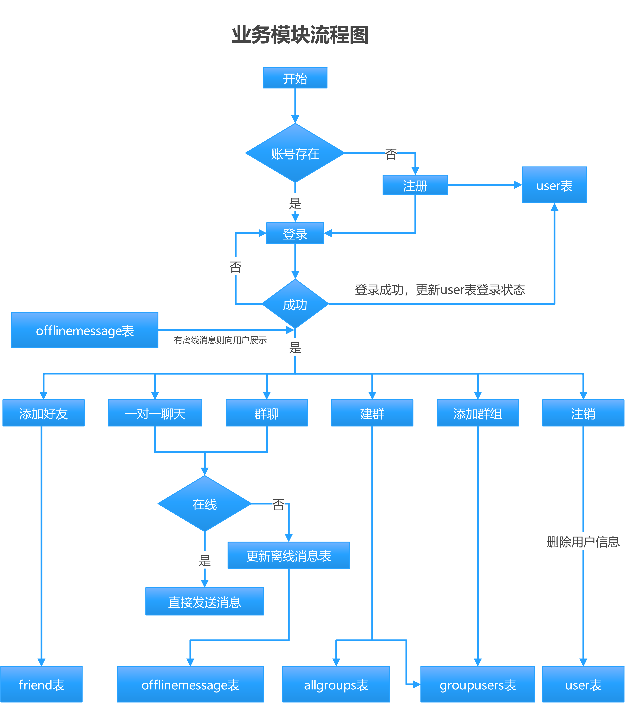

# clusterChatServer

## 项目介绍

本项目在 vscode 上开发进行，使用 ssh 远程连接 linux，还需要安装 redis，nginx，mysql，cmake 环境还需要 json 头文件，boost 与 muduo 网络开发库。	

该项目在 muduo 网络库的基础上实现了一个多线程、多 Reactor 模型的高并发聊天服务器，通过 Nginx 的 TCP 负载均衡模块分发客户端请求，并利用 Redis 的发布订阅功能同步服务器间的消息，实现用户注册，登录，群聊，一对一聊天，注销等功能，从而构建了一个高性能的集群聊天服务器。

## 项目架构

**项目整体架构如下图所示：**

图中可见，不同的客户端由 nginx 使用负载均衡算法分布到相应的服务器，这样可以在多个服务器之间分摊负载，提高系统的吞吐量和可靠性；为克服不同服务器之通信的问题，使用 redis 的发布订阅的模式接收消息然后发送给对应的服务器，避免了服务器之间两两相互连接的弊端。

## 网络模块

网络模块底层采用的 muduo 库，其采用的是 one loop per thread + nonblocking IO 的网络事件模型，其基于 epoll 的事件处理机制能够高效地处理网络事件，提供了高效的事件处理和内存管理方式。有一个较高 muduo 通过事件驱动的方式实现了异步 I/O，能够支持上万的并发连接。用户只需要关注连接和 socket 消息到来时的业务处理。使用 muduo 库作为项目的核心网络模块，提供高并发以及高可用网络 IO 服务，解耦网络、业务和数据模块的代码，提高了系统的可维护性和可扩展性。

## 数据模块设计与 ORM 实现

- **ORM（Object-Relational Mapping，对象关系映射）技术应用**:
    - 使用 ORM 技术，将数据库表映射为类，将表中的记录映射为对象，简化了数据操作。通过这种方式，开发者可以使用面向对象的编程风格与数据库交互，而无需直接编写复杂的 SQL 语句。

- **数据库编程与 SQL 组装**:
    - 编写封装类，用于组装 SQL 语句，执行数据库操作，并返回结果。通过封装数据操作类，实现了对数据库操作的统一管理和接口抽象。

- **接口类的暴露与对象创建**:
    - 对外提供统一的接口类，通过创建类对象，进行数据库的交互操作。所有数据库操作均通过接口类暴露的方法实现，确保了业务逻辑与数据操作的解耦。

- **数据操作示例**:
    - **用户数据管理**: 封装了用户数据的增删改查操作，如用户注册、登录、更新个人信息等。
    - **消息数据管理**: 封装了聊天消息的存储与查询操作，实现消息的持久化存储与快速检索。
    - **群组数据管理**: 封装了群组的创建、加入、退出等操作，实现了群组聊天功能。

## 业务逻辑

**主要的业务逻辑如下图所示：**

## 项目编译和安装

### 编译

#### 方法一

使用 CMakeLists.txt 文件，在 Linux 上构建 C++项目。

~~~bash
# 在项目根目录中创建一个名为 build 的目录，并在其中运行 CMake 工具。
su root 
# mkdir build
cd ./build
rm -rf *   # 删除上一次编译产生的 build 中的各种文件
cmake ..

# 在 build 目录中运行您生成的构建系统来构建项目
make
~~~

#### 方法二【推荐】

使用本项目已经编写好的自动化编译脚本文件 `autobuild.sh`，在 bash 中输入下述 语句：

~~~bash
su root
./autobuild.sh
~~~

### 运行项目代码

需要先启动 `redis` 和 `nginx` 服务器。

~~~bash
redis-server /myredis/redis.conf

cd /usr/local/nginx/sbin/
./nginx

# 查看 redis 和 nginx、mysql 是否已启动
netstat -antp
~~~

写了一个服务端 `ChatServer.cpp` 和客户端程序 `ChatClient.cpp`，编译后会在 `/bin` 目录下生成两个可执行文件 `ChatClient` 和 `ChatServer`，运行即可。

